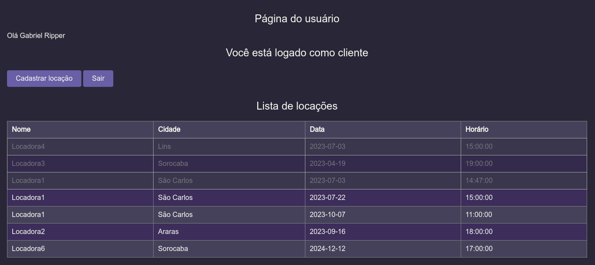
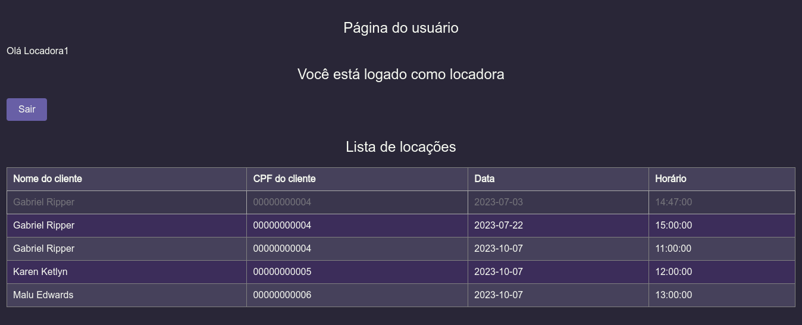
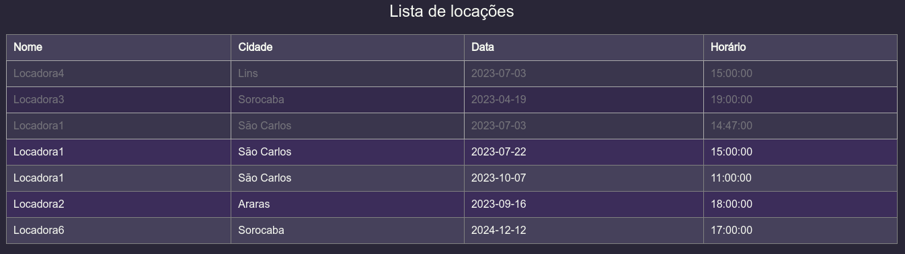
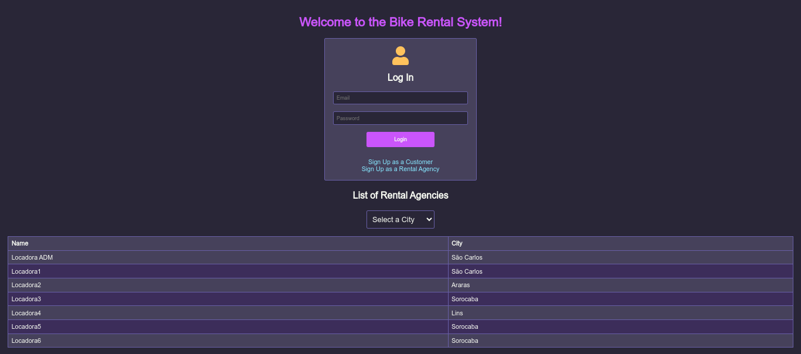

# DSW1-AA1
Atividade avaliativa 1 referente ao projeto da disciplina Desenvolvimento de Software para Web 1, ministrada pelo professor Alan Demetrius.

# Sistema para Locação de Bicicletas

Este projeto foi desenvolvido como parte da disciplina Desenvolvimento de Software para Web 1, ministrada pelo professor Alan Demetrius. O objetivo principal do projeto é criar uma aplicação web para um Sistema de Locação de Bicicletas. O documento de requisitos está presente no repositório.

## Resumo do Trabalho

### Tecnologias Utilizadas
O projeto foi criado utilizando as seguintes tecnologias do lado do servidor:
- Servlet
- JSP (JavaServer Pages)
- JSTL (JavaServer Pages Standard Tag Library)
- JDBC (Java Database Connectivity)

No ambiente de desenvolvimento, foram utilizados:
- Maven
- Apache Tomcat

Este trabalho buscou elaborar uma aplicação web sem utilizar frameworks, com o intuito de aprender como criar um ambiente web de forma mais detalhada e complexa. Foi seguida a arquitetura de separação de arquivos em Controladores, DAOs e Domain (classes), seguindo os princípios do MVC (Model-View-Controller).

## Página Home/Login

A página login.jsp contém um campo de login para autenticar-se como usuário ou administrador e também possui duas opções para cadastro como usuário, sendo Cliente ou Locadora. Foi tomada a decisão estratégica de disponibilizar a visualização de todas as locadoras na página de login, pois essa visualização não requer autenticação. Além disso, foi implementado um filtro para exibir apenas as locadoras da respectiva cidade.

## Página do Administrador

Os CRUDs estão disponíveis somente na página do administrador. As permissões estão configuradas corretamente e não é possível acessar algo para o qual você não possui permissão no momento. Foi tratada inclusive a vulnerabilidade de acesso direto a arquivos .jsp pela URL, movendo os arquivos .jsp que não podem ser acessados para dentro da pasta protegida WEB-INF. A única forma de atribuir alguém como administrador é através do CRUD.

## Página do Usuário

### Página do Usuário (Cliente)
Nesta página, é possível realizar o cadastro de uma locação selecionando uma data, horário e a respectiva locadora desejada. É tratada a impossibilidade de realizar locações no mesmo horário/dia. Também é possível visualizar uma tabela com todas as locações do cliente logado. Além disso, ao realizar uma locação, foi implementado um sistema de envio automático de e-mails.

### Página do Usuário (Locadora)
Nesta página, é possível visualizar todas as locações vinculadas à locadora logada.

## Status de Locações

Foi implementado que uma locação pode expirar caso o tempo de locação seja atingido. Isso foi feito através da comparação do horário limite da locação com o horário atual do sistema em que a aplicação está sendo executada.

## Refinamentos Finais

### Internacionalização do Sistema
O sistema é internacionalizado em PT-BR e EN-US, dependendo da configuração do navegador do usuário.

### Erros Amigáveis
A aplicação apresenta mensagens de erro amigáveis no caso de exceções e erros.

# Colaboradores

- Leonardo da Silva Lopes, aluno BCC UFSCar, github: github.com/leonardo-lopes-br
- Vitor Kasai Tanoue, aluno BCC UFSCar, github: github.com/vitorkasai
- Maria Luiza Edwards, aluna BCC UFSCar, github: github.com/maluedwards
- Karen Ketlyn Barcelos, aluna BCC UFSCar, github: github.com/42kkkkkaren